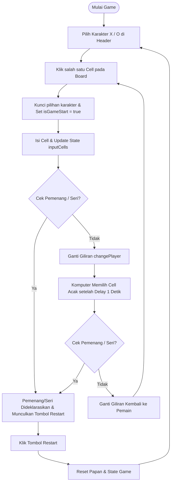

# Penjelasan Cara Kerja & Alur Kode: Tic Tac Toe

Dokumen ini berisi penjelasan lengkap mengenai struktur kode, alur kerja, dan logika pemrograman dari aplikasi **Tic Tac Toe** sederhana yang telah dibuat. Game ini dimainkan oleh satu pemain (manusia) melawan komputer yang memilih langkah secara acak (*random bot*).

---

## 📂 Struktur Berkas (Project Structure)

Proyek ini terdiri dari 3 berkas utama:
1. **`index.html`**: Menyediakan struktur HTML dari papan permainan (grid 3x3), header status, pilihan karakter (X/O), dan tombol restart.
2. **`style.css`**: Memberikan tampilan estetis modern dengan tema gelap (*dark theme*), pengaturan grid CSS, efek hover, serta pewarnaan khusus untuk simbol `X` (biru) dan `O` (ungu).
3. **`script.js`**: Menyimpan seluruh logika permainan, penanganan interaksi (*event handling*), alur giliran bermain, deteksi pemenang, dan mekanisme bot komputer.

---

## 🔄 Alur Kerja Utama (Workflow)

Berikut adalah alur jalan permainan dari awal hingga selesai:



### Penjelasan Detail Tiap Langkah:
1. **Inisialisasi & Pemilihan Karakter**:
   Saat halaman pertama kali dimuat, pemain dapat memilih untuk bermain sebagai **X** (default) atau **O** dengan mengklik indikator di header. Pilihan ini hanya bisa dilakukan **sebelum** permainan dimulai (`isGameStart === false`).
2. **Langkah Pemain**:
   Ketika pemain mengklik kotak (cell) yang kosong, sistem akan langsung menempatkan simbol pemain tersebut, mengubah status permainan menjadi telah dimulai (`isGameStart = true`), dan memeriksa apakah langkah tersebut menghasilkan kemenangan atau seri.
3. **Pemeriksaan Pemenang**:
   Sistem mengecek seluruh kombinasi garis kemenangan (3 horizontal, 3 vertikal, 2 diagonal). Jika ditemukan kecocokan, game selesai. Jika semua kotak terisi tanpa pemenang, game dideklarasikan seri (*draw*).
4. **Langkah Komputer**:
   Jika permainan belum berakhir, giliran diganti ke komputer. Selama komputer "berpikir" (ada jeda/delay selama 1 detik), permainan akan di-pause (`isPauseGame = true`) agar pemain manusia tidak bisa mengklik kotak lain. Komputer memilih kotak kosong secara acak, menaruh simbolnya, mengecek kemenangan, lalu mengembalikan giliran ke pemain.
5. **Reset Permainan**:
   Jika permainan berakhir (menang/seri), tombol **Restart** akan muncul. Ketika diklik, seluruh papan akan dikosongkan, semua variabel state disetel ulang ke kondisi awal, dan pemain dapat memilih karakter kembali.

---

## 💻 Penjelasan Logika & Fungsi Kode (`script.js`)

Berikut adalah bedah fungsi dan variabel state yang digunakan di dalam berkas JavaScript:

### 1. Variabel State (Penyimpan Kondisi Game)
* **`player`**: Menyimpan siapa yang saat ini berhak melangkah (`"X"` atau `"O"`).
* **`isPauseGame`**: Bernilai `true` saat komputer sedang mengambil giliran atau permainan selesai, mencegah klik pemain yang tidak disengaja.
* **`isGameStart`**: Berubah menjadi `true` setelah klik pertama pada papan, digunakan untuk mengunci pemilihan karakter di header agar tidak bisa diubah di tengah permainan.
* **`inputCells`**: Array berisi 9 string kosong `["", "", "", "", "", "", "", "", ""]` yang melacak isi dari masing-masing kotak di papan permainan.

### 2. Kombinasi Kemenangan (`winConditions`)
Sebuah array 2 dimensi yang memetakan indeks indeks grid yang membentuk garis lurus (baris, kolom, atau diagonal):
```javascript
const winConditions = [
  [0, 1, 2], [3, 4, 5], [6, 7, 8], // Baris (Horizontal)
  [0, 3, 6], [1, 4, 7], [2, 5, 8], // Kolom (Vertikal)
  [0, 4, 8], [2, 4, 6]             // Diagonal
];
```

### 3. Fungsi Utama & Logika Eksekusinya

* **`tapCell(cell, index)`**
  Dipicu saat pemain mengklik kotak di papan. Fungsi ini memastikan kotak yang diklik masih kosong (`textContent === ""`) dan permainan sedang tidak di-pause. Jika valid, ia memanggil `updateCell()`, lalu mengecek pemenang. Jika belum ada pemenang, giliran berganti ke komputer lewat `randomPick()`.

* **`updateCell(cell, index)`**
  Bertanggung jawab memperbarui tampilan visual kotak di layar (HTML text content) serta menyimpannya ke dalam array pelacak state `inputCells[index]`. Fungsi ini juga memberikan warna yang berbeda: biru untuk `X` dan ungu untuk `O`.

* **`changePlayer()`**
  Mengubah nilai variabel `player` secara bergantian dari `"X"` ke `"O"` atau sebaliknya.

* **`randomPick()`**
  Logika kecerdasan buatan (AI) komputer:
  1. Mengaktifkan `isPauseGame = true` untuk membekukan papan.
  2. Menggunakan `setTimeout` dengan jeda **1000 milidetik (1 detik)** untuk memberikan efek seolah-olah komputer sedang berpikir.
  3. Menggunakan perulangan `do-while` untuk mencari indeks acak (`Math.random()`) yang masih kosong pada array `inputCells`.
  4. Mengisi kotak terpilih, melakukan pemeriksaan kemenangan, dan jika tidak ada pemenang, ia akan mengembalikan kendali ke pemain manusia (`isPauseGame = false`).

* **`checkWinner()`**
  Melakukan perulangan untuk memeriksa setiap kombinasi yang ada di `winConditions` terhadap isi array `inputCells`. Jika salah satu pola memiliki simbol yang sama dan tidak kosong, fungsi memicu `declareWinner()`. Jika seluruh kotak sudah terisi penuh namun tidak ada pemenang, fungsi memicu `declareDraw()`.

* **`declareWinner(WinningIndices)`**
  Mengubah teks judul menjadi `"X WIN!!!"` atau `"O WIN!!!"`, membekukan permainan, mewarnai latar belakang kotak-kotak yang menang dengan warna gelap ungu tua (`#2A2343`), dan menampilkan tombol **Restart**.

* **`choosePlayer(selectedPlayer)`**
  Mengizinkan pemain mengklik huruf "X" atau "O" di header sebelum permainan dimulai untuk menentukan simbol awalnya. Fungsi ini juga mengatur kelas CSS `.player-active` untuk memberikan efek visual karakter mana yang sedang aktif dipilih.

* **Event Listener Restart (`restartBtn`)**
  Ketika tombol Restart diklik, fungsi akan menyembunyikan kembali tombol restart, membersihkan array `inputCells`, mengosongkan semua isi teks dan warna latar kotak pada UI, menyetel ulang variabel kontrol (`isPauseGame`, `isGameStart`), dan mengembalikan teks header menjadi `"Choose"`.

---

## 🎨 Detail Desain Visual (`style.css`)
* **Grid Layout**: Menggunakan CSS Grid (`display: grid`) pada `#board` dengan `grid-template-columns: repeat(3, 70px)` untuk membentuk papan 3x3 yang presisi.
* **Warna Tema Gelap (Dark Theme)**: Latar belakang aplikasi menggunakan warna gelap keunguan (`#0a0519`) dengan kontras kotak `#17122a`, memberikan kesan modern dan futuristik yang nyaman di mata.
* **Interaktivitas Lembut**: Tombol dan kotak memiliki transisi animasi selama `0.3s` saat disorot (*hover*) untuk memberikan umpan balik visual yang responsif bagi pengguna.
